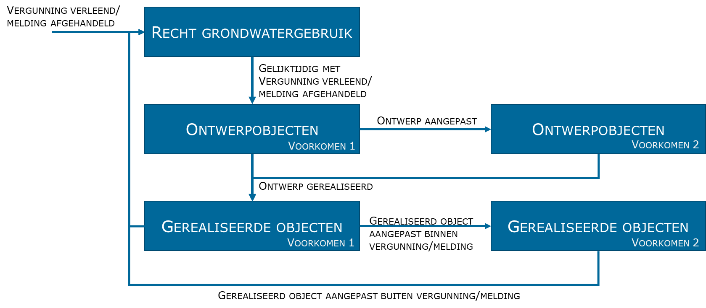

Toelichting GUF
===============

Levensduur en historie
----------------------

In het stelsel van basisregistraties geldt bij het modelleren van levensduur en
historie een onderscheid in materiële levensduur en historie en formele
levensduur en historie.

Materiële historie beschrijft de veranderingen van een object in de
werkelijkheid. Formele historie beschrijft de historie van veranderingen van een
object in de registratie. Analoog hieraan beschrijft de materiële levensduur het
initïele ontstaan en vervallen van een object in de werkelijkheid, de formele
levensduur van een object in de registratie.

De formele levensduur en historie worden generiek voor alle registratieobjecten
middels de gegevensgroep Registratiegeschiedenis vastgelegd.

De **materiële levensduur** wordt per object vastgelegd met de attributen
begintijd en eindtijd. De begintijd van een ontwerp installatie is de datum
waarop het eerste ontwerp is ontstaan; de eindtijd de datum waarop het ontwerp
definitief vervalt. De begintijd van een gerealiseerd object is de datum waarop
het ontwerp is gerealiseerd en het object is ingericht; de eindtijd de datum
waarop het gerealiseerde object definitief buiten gebruik is gesteld, of is
gesloopt.

De **materiële historie** wordt per object vastgelegd met de attributen
beginGeldigheid en eindGeldigheid. De beginGeldigheid is de datum waarop de
betreffende instantie c.q. het voorkomen van een object geldig wordt; de
eindGeldigheid is de datum waarop de geldigheid van de betreffende instantie
c.q. het voorkomen van een object vervalt.

Voor de objecten binnen het grondwatergebruiksysteem gelden de volgende
uitgangspunten voor de levensduur en historie:

1.  Recht grondwatergebruik en ontwerpobjecten ontstaan in de BRO na een
    gebeurtenis ‘Vergunning verleend’ of Melding afgehandeld’. Recht
    grondwatergebruik krijgt een beginGeldigheid, en de ontwerp objecten krijgen
    een begintijd en beginGeldigheid met beide dezelfde datum.

2.  Als een ontwerp object wordt aangepast binnen de kader van een
    melding/vergunning, ontstaat een nieuwe voorkomen van een ontwerp object,
    waarbij

3.  Gerealiseerde objecten ontstaan in de BRO na de gebeurtenis ‘Ontwerp
    gerealiseerd’. De ontwerp objecten krijgen een begintijd en beginGeldigheid
    met beide dezelfde datum.

4.  Als een ontwerp object of gerealiseerd object binnen de kaders van een
    melding/vergunning wijzigt, ontstaat een nieuw voorkomen van dit object,
    waarbij:

    -   het vorige voorkomen van object een eindGeldigheid krijgt,

    -   het nieuwe voorkomen krijgt een beginGeldigheid welke dezelfde datum
        heeft als de eindGeldigheid van het vorige voorkomen van het object.

5.  Als van een ontwerp object het ontwerp definitief wordt beëindigd, of een
    gerealiseerd object definitief wordt buiten gebruik gesteld of gesloopt,
    wordt het object beëindigd en krijgt het een eindtijd en eindGeldigheid met
    beide dezelfde datum.

Vorige voorkomens van een object blijven dus beschikbaar in de Landelijke
Voorziening, maar worden ‘inactief gemaakt’ c.q. ‘niet-actueel verklaar’ door
middel van een datum eindGeldigheid.

*Figuur: Levenscyclus objecten binnen het grondwatergebruiksysteem*

**Voorbeeld**

Op 01-01-2021 wordt een vergunning voor grondwaterontrekking verleend met
ingangsdatum 01-02-2021 is. In de vergunning is geen einddatum opgenomen. De
grondwaterontrekking bestaat uit een installatie met 1 grondwaterontrekkingsput.
In de LV BRO worden de volgende objecten opgevoerd.

|                          | ID  | Voorkomen | beginTijd  | eindTijd | beginGeldigheid | eindGeldigheid |
|--------------------------|-----|-----------|------------|----------|-----------------|----------------|
| Grondwatergebruiksysteem | 001 | 1         | 01-02-2012 | «leeg»   | 01-02-2021      | «leeg»         |
| Recht grondwatergebruik  | 101 | 1         | *n.v.t.*   | *n.v.t.* | 01-02-2021      | «leeg»         |
| Ontwerp installatie      | 201 | 1         | 01-02-2012 | «leeg»   | 01-02-2021      | «leeg»         |
| Ontwerpput               | 301 | 1         | 01-02-2012 | «leeg»   | 01-02-2021      | «leeg»         |

Per 01-03-2021 wordt de maximale pompcapaciteit binnen de kaders van de
vergunning van het ontwerp van de put aangepast. In de BRO ontstaat een nieuw
voorkomen van de ontwerpput, het eerste voorkomen krijgt een eindgeldheid per
01-03-2021.

|                          | ID      | Voorkomen | beginTijd      | eindTijd   | beginGeldigheid | eindGeldigheid |
|--------------------------|---------|-----------|----------------|------------|-----------------|----------------|
| Grondwatergebruiksysteem | 001     | 1         | 01-02-2012     | «leeg»     | 01-02-2021      | «leeg»         |
| Recht grondwatergebruik  | 101     | 1         | *n.v.t.*       | *n.v.t.*   | 01-02-2021      | «leeg»         |
| Ontwerp installatie      | 201     | 1         | 01-02-2012     | «leeg»     | 01-02-2021      | «leeg»         |
| Ontwerpput               | 301     | 1         | 01-02-2012     | «leeg»     | 01-02-2021      | **01-03-2021** |
| **Ontwerpput**           | **302** | **2**     | **01-02-2012** | **«leeg»** | **01-03-2021**  | **«leeg»**     |

Per 01-06-2021 is de put gerealiseerd. In de BRO wordt een gerealiseerde
installatie en gerealiseerde put opgenomen. De gerealiseerde installatie en put
worden toegevoegd aan het Grondwatergebruiksysteem dat een nieuw voorkomen
krijgt.

|                               | ID      | Voorkomen | beginTijd      | eindTijd   | beginGeldigheid | eindGeldigheid |
|-------------------------------|---------|-----------|----------------|------------|-----------------|----------------|
| Grondwatergebruiksysteem      | 001     | 1         | 01-02-2012     | «leeg»     | 01-02-2021      | **01-06-2021** |
| **Grondwatergebruiksysteem**  | **001** | **2**     | **01-02-2012** | **«leeg»** | **01-06-2021**  | **«leeg»**     |
| Recht grondwatergebruik       | 101     | 1         | *n.v.t.*       | *n.v.t.*   | 01-02-2021      | «leeg»         |
| Ontwerp installatie           | 201     | 1         | 01-02-2012     | «leeg»     | 01-02-2021      | «leeg»         |
| Ontwerpput                    | 301     | 1         | 01-02-2012     | «leeg»     | 01-02-2021      | 01-03-2021     |
| Ontwerpput                    | 301     | 2         | 01-02-2012     | «leeg»     | 01-03-2021      | «leeg»         |
| **Gerealiseerde installatie** | **401** | **1**     | **01-06-2021** | **«leeg»** | **01-06-2021**  | **«leeg»**     |
| **Gerealiseerde put**         | **501** | **1**     | **01-06-2021** | **«leeg»** | **01-06-2021**  | **«leeg»**     |

Per 01-09-2021 wordt een wijzigingsvergunning verleend voor het toevoegen van
een extra put aan de installatie. De wijzigingsvergunning en het ontwerp van de
extra put worden opgenomen in de BRO en toegevoegd aan het
grondwatergebruikssysteem.

|                              | ID      | Voorkomen | beginTijd      | eindTijd   | beginGeldigheid | eindGeldigheid |
|------------------------------|---------|-----------|----------------|------------|-----------------|----------------|
| Grondwatergebruiksysteem     | 001     | 1         | 01-02-2012     | «leeg»     | 01-02-2021      | 01-06-2021     |
| Grondwatergebruiksysteem     | 001     | 2         | 01-02-2012     | «leeg»     | 01-06-2021      | **01-09-2021** |
| **Grondwatergebruiksysteem** | **001** | **3**     | **01-02-2012** | **«leeg»** | **01-09-2021**  | **«leeg»**     |
| Recht grondwatergebruik      | 101     | 1         | *n.v.t.*       | *n.v.t.*   | 01-02-2021      | «leeg»         |
| **Rechtgrondwatergebruik**   | **102** | **1**     | *n.v.t.*       | *n.v.t.*   | **01-09-2021**  | **«leeg»**     |
| Ontwerp installatie          | 201     | 1         | 01-02-2012     | «leeg»     | 01-02-2021      | «leeg»         |
| Ontwerpput                   | 301     | 1         | 01-02-2012     | «leeg»     | 01-02-2021      | 01-03-2021     |
| Ontwerpput                   | 301     | 2         | 01-02-2012     | «leeg»     | 01-03-2021      | «leeg»         |
| **Ontwerpput**               | **302** | **1**     | **01-09-2012** | **«leeg»** | **01-09-2021**  | **«leeg»**     |
| Gerealiseerde installatie    | 401     | 1         | 01-06-2021     | «leeg»     | 01-06-2021      | «leeg»         |
| Gerealiseerde put            | 501     | 1         | 01-06-2021     | «leeg»     | 01-06-2021      | «leeg»         |

Per 01-10-2021 is de extra ontwerpput gerealiseerd en wordt de gerealiseerde
toegevoegd aan het grondwatergebruiksysteem in de BRO.

|                              | ID      | Voorkomen | beginTijd      | eindTijd   | beginGeldigheid | eindGeldigheid |
|------------------------------|---------|-----------|----------------|------------|-----------------|----------------|
| Grondwatergebruiksysteem     | 001     | 1         | 01-02-2012     | «leeg»     | 01-02-2021      | 01-06-2021     |
| Grondwatergebruiksysteem     | 001     | 2         | 01-02-2012     | «leeg»     | 01-06-2021      | 01-09-2021     |
| Grondwatergebruiksysteem     | 001     | 3         | 01-02-2012     | «leeg»     | 01-09-2021      | **01-10-2021** |
| **Grondwatergebruiksysteem** | **001** | **3**     | **01-02-2012** | **«leeg»** | **01-10-2021**  | **«leeg»**     |
| Recht grondwatergebruik      | 101     | 1         | *n.v.t.*       | *n.v.t.*   | 01-02-2021      | «leeg»         |
| Rechtgrondwatergebruik       | 102     | 1         | *n.v.t.*       | *n.v.t.*   | 01-09-2021      | «leeg»         |
| Ontwerp installatie          | 201     | 1         | 01-02-2012     | «leeg»     | 01-02-2021      | «leeg»         |
| Ontwerpput                   | 301     | 1         | 01-02-2012     | «leeg»     | 01-02-2021      | 01-03-2021     |
| Ontwerpput                   | 301     | 2         | 01-02-2012     | «leeg»     | 01-03-2021      | «leeg»         |
| Ontwerpput                   | 302     | 1         | 01-09-2012     | «leeg»     | 01-09-2021      | «leeg»         |
| Gerealiseerde installatie    | 401     | 1         | 01-06-2021     | «leeg»     | 01-06-2021      | «leeg»         |
| Gerealiseerde put            | 501     | 1         | 01-06-2021     | «leeg»     | 01-06-2021      | «leeg»         |
| **Gerealiseerde put**        | **502** | **1**     | **01-06-2021** | **«leeg»** | **01-10-2021**  | **«leeg»**     |

Per 01-01-2022 wordt de gerealiseerde installatie en putten buiten werking
gesteld. De vergunning blijft wel geldig. In de BRO worden de gerealiseerde
installatie en putten beëindigd.

|                           | ID  | Voorkomen | beginTijd  | eindTijd        | beginGeldigheid | eindGeldigheid  |
|---------------------------|-----|-----------|------------|-----------------|-----------------|-----------------|
| Grondwatergebruiksysteem  | 001 | 1         | 01-02-2012 | «leeg»          | 01-02-2021      | 01-06-2021      |
| Grondwatergebruiksysteem  | 001 | 2         | 01-02-2012 | «leeg»          | 01-06-2021      | 01-09-2021      |
| Grondwatergebruiksysteem  | 001 | 3         | 01-02-2012 | «leeg»          | 01-09-2021      | 01-10-2021      |
| Grondwatergebruiksysteem  | 001 | 3         | 01-02-2012 | «leeg»          | 01-10-2021      | «leeg»          |
| Recht grondwatergebruik   | 101 | 1         | *n.v.t.*   | *n.v.t.*        | 01-02-2021      | «leeg»          |
| Rechtgrondwatergebruik    | 102 | 1         | *n.v.t.*   | *n.v.t.*        | 01-09-2021      | «leeg»          |
| Ontwerp installatie       | 201 | 1         | 01-02-2012 | «leeg»          | 01-02-2021      | «leeg»          |
| Ontwerpput                | 301 | 1         | 01-02-2012 | «leeg»          | 01-02-2021      | 01-03-2021      |
| Ontwerpput                | 301 | 2         | 01-02-2012 | «leeg»          | 01-03-2021      | «leeg»          |
| Ontwerpput                | 302 | 1         | 01-09-2012 | «leeg»          | 01-09-2021      | «leeg»          |
| Gerealiseerde installatie | 401 | 1         | 01-06-2021 | **01-01-2-022** | 01-06-2021      | **01-01-2-022** |
| Gerealiseerde put         | 501 | 1         | 01-06-2021 | **01-01-2-022** | 01-06-2021      | **01-01-2-022** |
| Gerealiseerde put         | 502 | 1         | 01-06-2021 | **01-01-2-022** | 01-10-2021      | **01-01-2-022** |
