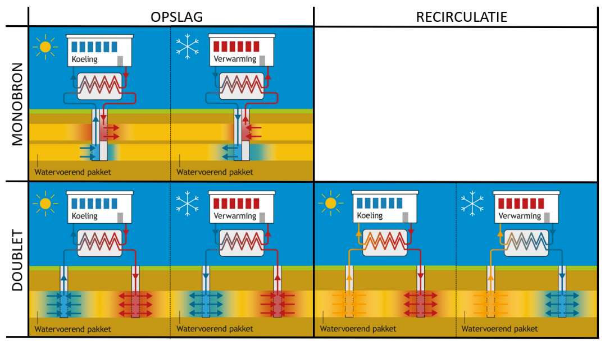

Grondwatergebruiksysteem
===================

Inleiding grondwatergebruik
----------------------------------

Grondwater is een belangrijke bestaansbron. Voor uiteenlopende doelen wordt
actief gebruik gemaakt van grondwater. Deels richt het gebruik zich op het
grondwater zelf, maar bij ondiepe bodemenergie richt het gebruik zich ook op het
warmte leverend en bufferend vermogen van de ondergrond en het zich daarin
bevindende grondwater. Een goed zicht op het huidige gebruik van grondwater -in
samenhang met het monitoren van grondwaterstanden en stijghoogtes- helpt om de
effecten ervan te begrijpen en om nieuwe gebruiksaanvragen te kunnen beoordelen
en zodoende het grondwater als belangrijke bestaansbron duurzaam te beschermen
en beheren. Het registratiedomein Grondwatergebruik richt zich op de registratie
en ontsluiting van informatie over de technische systemen die grondwater
benutten. De belangrijkste focus in de gegevensdefinitie ligt daarbij op de
locatie en diepte van het systeem en op het gebruik (hoeveelheid water en
energie) van het grondwater. Dit zijn de gegevens met directe hergebruikswaarde.

Het domein Grondwatergebruik valt uiteen in twee registratieobjecten:
Grondwatergebruiksysteem (GUF) en Grondwaterproductiedossier (GPD), dit wordt in
de volgende paragraaf nader toegelicht. Het gebruik van grondwater is via wet-
en regelgeving sterk gereguleerd. Juridisch wordt daarbij onderscheid gemaakt
tussen “onttrekking”; waarmee het oppompen van grondwater wordt bedoeld,
“infiltratie”; waarmee het in de bodem brengen van water met het oog op latere
onttrekking wordt bedoeld en “lozing”; waarmee het in de bodem brengen van water
wordt bedoeld, zonder dat sprake is van latere onttrekking. Deze laatste vorm
van grondwatergebruik (lozing) is buiten scope geplaatst. Ook het gebruik van
ondergrond en grondwater voor opslag en onttrekking van bodemenergie is
wettelijk gedefinieerd. Dergelijke systemen worden ook geregistreerd in het
registratieobject grondwatergebruiksysteem.

Als bevoegde gezagen in het grondwatergebruikdomein zijn Provincies,
Waterschappen, Gemeenten en voor enkele specifieke situaties de Rijksoverheid
(meer specifiek Rijkswaterstaat) aangewezen. Deze organisaties toetsen nieuwe
vergunningaanvragen of ontvangen meldingen voor grondwatergebruik. Tevens spelen
zij een rol in het toezicht en de handhaving op gebruik(ers) van de
grondwatergebruiksystemen. Gemeentelijke en provinciale taken worden vaak door
Omgevingsdiensten uitgevoerd. Het bronhouderschap voor BRO registratiedomein
Grondwatergebruik zal bij de bevoegde gezagen worden belegd.

Onder het registratieobject Grondwatergebruiksysteem worden onttrekking- en
infiltratiesystemen, en bodemenergiesystemen geregistreerd. Meer specifiek
worden uitsluitend alle vergunde- en meldingsplichtige systemen geregistreerd.
Dit is nader omschreven in het Besluit BasisRegistratie Ondergrond. In de
praktijk betekent dit dat alle grotere systemen onder de registratieplicht
vallen. Doordat de bevoegde gezagen van de wetgever ruimte hebben gekregen om
aanvullende regels en verordeningen op te stellen, is geen landsdekkende
uniforme volume-ondergrens voor de vergunning- of meldingsplicht vast te
stellen. Met name rond de kleinere grondwatergebruiksystemen kan de vergunning-
of meldingsplicht en daarmee dus de registratie van deze
grondwatergebruiksystemen per bevoegd gezag verschillen. De periode van het
grondwatergebruik is niet bepalend voor het al of niet registreren van dit
grondwatergebruik. 

Naast de juridische voorschriften rond het aanleveren van informatie ten behoeve
van vergunningaanvragen of meldingen zijn in het werkveld diverse standaarden en
richtlijnen opgesteld. Hierdoor is de informatie-uitwisseling in de fase van de
vergunningaanvraag en/of melding tussen de bevoegde gezagen enerzijds en de
betrokken partijen anderzijds deels al gestandaardiseerd. Vanuit die
informatieketen wordt de benodigde informatie over grondwatergebruik al
uitgewisseld. De voorliggende gegevensinhoud is hierop een verbijzondering die
voldoet aan de eisen van een basisregistratie.

Geografisch wordt de registratie van grondwatergebruiksystemen in dit
registratieobject begrensd op een diepte van maximaal 500 meter beneden
maaiveld. Gegevens van systemen waarvan delen dieper dan 500 meter onder
maaiveld liggen, worden binnen het registratiedomein Mijnbouwwet onder de
registratieobjecten Mijnbouwwetvergunning en Mijnbouwwetconstructie
geregistreerd. Daarnaast bevat de registratie uitsluitend informatie over de
ondergrond van Nederland en haar Exclusieve Economische Zone (EEZ). De EEZ is
het gebied op de Noordzee waar Nederland economische rechten heeft.

De volledige scopeafbakening is beschreven in het Scopedocument Domein
Grondwatergebruik (GU). Deze is te raadplegen op:
https://bro-productomgeving.nl/bpo/latest/grondwatergebruik/grondwatergebruiksysteem-guf

Domein grondwatergebruik in de BRO
----------------------------------

Het domein grondwatergebruik in de basisregistratie ondergrond (BRO) omvat de
volgende twee registratieobjecten:

-   Grondwatergebruiksysteem;

-   Grondwaterproductiedossier.

In de voorliggende catalogus gaat het over het registratieobject
grondwatergebruiksysteem.

In de technische landelijke voorziening van de basisregistratie ondergrond
worden Engelstalige benamingen gehanteerd voor de registratieobjecten. Omwille
van de aansluiting hiermee worden voor de registratieobjecten Engelstalige
afkortingen gebruikt. In deze catalogus worden alleen de Engelstalige
afkortingen en verder de Nederlandstalige termen gebruiken.

-   Grondwatergebruiksysteem wordt afgekort tot GUF (Groundwater Usage
    Facility);

-   Grondwaterproductiedossier wordt afgekort tot GPD (Groundwater Production
    Dossier).

<figure id='image002'>
  
  <figcaption>De mogelijke samenhang tussen de twee registratieobjecten grondwatergebruiksysteem en grondwaterproductiedossier binnen het domein grondwatergebruik. Onder het IMBRO-regime heeft de inhoud van het Grondwaterproductiedossier voornamelijk betrekking op het installatie-niveau onder GUF. Onder het IMBRO/A-regime hebben deze gegevens voornamelijk betrekking op het Grondwatergebruiksysteem onder GUF. In het figuur is met dunne lijnen aangegeven dat onder het IMBRO-regime een klein deel van de inhoud van het Grondwaterproductiedossier betrekking zal hebben op het grondwatergebruiksysteem-niveau van GUF. Een klein deel van inhoud van de Grondwaterproductiedossiers onder het IMBRO/A-regime zal betrekking hebben op het installatie-niveau van GUF.</figcaption>
</figure>

Een grondwatergebruiksysteem betreft de constructie die gebruikt wordt om
grondwater te onttrekken aan, en te brengen in de ondergrond. Ook zijn systemen
opgenomen die niet direct gebruik maken van het grondwater zelf, maar die alleen
indirect gebruik maken van het grondwater, namelijk van de warmtecapaciteit van
het grondwater. Het registratieobject grondwatergebruiksysteem bevat gegevens
die bij de vergunningverlening (in de beschikking) of in melding zijn vastgelegd
over het ontwerp van het systeem. Daarnaast bevat dit registratieobject gegevens
over het in de praktijk gerealiseerde systeem. Onderdelen van zowel het ontwerp
als van het gerealiseerde systeem hebben een geometrie.

Een grondwaterproductiedossier bevat de in de loop van de tijd aan het bevoegd
gezag op grond van wettelijke plicht gerapporteerde productiecijfers van een
grondwatergebruiksysteem. Een grondwaterproductiedossier heeft zelf geen
verticale positie en locatie. Bij een grondwaterproductiedossier wordt de
relatie vastgelegd met het grondwatergebruiksysteem waar de productiecijfers
betrekking op hebben.

Een grondwaterproductiedossier en het grondwatergebruiksysteem waar dat
grondwaterproductiedossier betrekking op heeft, vallen onder de
verantwoordelijkheid van dezelfde bronhouder.

Inleiding grondwatergebruiksysteem
----------------------------------

### Inleiding

Een *Grondwatergebruiksysteem (GUF)* is een technisch of organisatorisch
samenhangend systeem van tenminste één of meerdere buizen of slangen in de
ondergrond en waarmee een vorm van grondwatergebruik kan plaatsvinden. Dit
gebruik kan zich richten op het grondwater zelf (bijvoorbeeld voor de bereiding
van drinkwater of voor bluswater), maar ook op de warmtecapaciteit van de
ondergrond en het grondwater daarbinnen in het geval van bodemenergiesystemen.
De registratie van deze systemen moet de vraag beantwoorden hoe, waar, waartoe
en met welke capaciteit gebruik wordt gemaakt van grondwater. De in de BRO te
registreren informatie van de grondwatergebruiksystemen ontstaat in het
werkproces van de bevoegde gezagen. Paragraaf 3.3.2 beschrijft de opeenvolgende
stappen van het proces waarin de gegevens ontstaan. Paragraaf 3.3.3 beschrijft
een aantal belangrijke kenmerken van de gegevens over het
grondwatergebruiksysteem. 

### Het proces van gegevensverwerking

Het proces waarin gegevens van grondwatergebruiksystemen in de praktijk ontstaan
is schematisch weergegeven in de onderstaande figuur en wordt daaronder
beschreven. 

<figure id='image003'>
  
  <figcaption>Het totstandkomingsproces van gegevens voor de registratieobjecten
Grondwatergebruiksysteem (beige pijlen) en Grondwaterproductiedossier (rode
pijlen) en de daarbij betrokken actoren.</figcaption>
</figure>

Ontwerpen van nieuw aan te leggen grondwatergebruiksystemen worden door
initiatiefnemers middels een vergunningaanvraag of melding aan het bevoegd gezag
kenbaar gemaakt. Wanneer de vergunningaanvraag of de melding door het bevoegd
gezag positief is beoordeeld, worden de ontwerpgegevens door het bevoegd gezag
aan de BRO aangeleverd en bij het registratieobject Grondwatergebruiksysteem
geregistreerd. Het grondwatergebruiksysteem wordt daarna 'volgens ontwerp'
aangelegd. Het bevoegd gezag schrijft voor dat bepaalde gegevens uit de
realisatiefase door de aanleggende partij worden geregistreerd en met het
bevoegd gezag worden gedeeld. Dit kan gaan om afwijkingen van het ontwerp of om
gegevens die pas bij de aanleg exact kunnen worden vastgesteld (zoals de
filterdiepte). Dergelijke afwijkingen en detailinformatie dienen aan het bevoegd
gezag te worden teruggekoppeld. Dergelijke aanvullende gegevens uit de
realisatiefase dienen ook te worden geregistreerd in de BRO onder het
registratieobject Grondwatergebruiksysteem. Tenslotte kunnen gedurende de
levensfase van het systeem technische aanpassingen worden doorgevoerd en wordt
het systeem uiteindelijk buiten bedrijf gesteld. Van deze belanghebbende
wijzigingen wordt het bevoegd gezag op de hoogte gesteld. Het bevoegd gezag
registreert een aantal van deze wijzigingen in het registratieobject
Grondwatergebruiksysteem.

Gegevens over het feitelijke gebruik van grondwater worden door vergunningnemers
periodiek aan het bevoegd gezag geleverd. Het bevoegd gezag levert een deel van
deze gegevens aan de BRO aan binnen het registratieobject
Grondwaterproductiedossier.

### Eigenschappen van grondwatergebruiksystemen die de gegevensinhoud van het registratieobject bepalen

In het standaardisatietraject is gebleken dat grondwatergebruiksystemen een
aantal eigenschappen hebben die sturing geven aan de gegevensinhoud van het
registratieobject grondwatergebruiksysteem. Hieronder zijn de belangrijkste
sturende kenmerken kort toegelicht. In de beschrijving van de gegevensinhoud
(paragraaf 1.4) wordt per entiteit een nadere, specifieke toelichting gegeven.

**Onderscheid en samenhang tussen ontwerpgegevens enerzijds en
realisatie-gegevens anderzijds**

Het is belangrijk te weten waar grondwater precies wordt onttrokken. Deze vraag
kan bij benadering met behulp van de ontwerpgegevens worden beantwoord. Van
sommige systeemkenmerken (bijvoorbeeld de putlocatie of filterdiepte) is het
nuttig om ook realisatie-gegevens vast te leggen, omdat de uitvoering af kan
wijken van het ontwerp én omdat bijvoorbeeld de exacte filterdiepte pas tijdens
de realisatie wordt bepaald. 

**De hiërarchie en kardinaliteit van registratieonderdelen**

De praktijk laat een veelheid aan uitvoeringsmogelijkheden van
grondwatergebruiksystemen zien. Sommige beschikkingen of meldingen zijn heel
overzichtelijk; deze richten zich op één filter in één put, of op één bodemlus,
onder één zelfstandig systeem. Andere situaties zijn complexer; meerdere filters
in meerdere putten, of meerdere bodemlussen, die bij één of verschillende
installaties horen en die op hun beurt, als gevolg van technische of
organisatorische samenhang, tot één beschikking of melding behoren. Deze
complexiteit is met diverse bevoegd gezagen en andere relevante stakeholders
uitgebreid besproken en in het gegevensmodel eenduidig vastgelegd. Figuur 3 laat
schematisch een aantal verschillende situaties zien. In paragraaf 1.4 wordt hier
verder op in gegaan.

Figuur 3: Schematisch overzicht van mogelijke variaties van systeemonderdelen
binnen drie verschillende grondwatergebruiksystemen. In dit schema is de put met
filters uitgewerkt. Dit zou ook een bodemlus kunnen zijn en ook
oppervlakte-infiltraties maken onderdeel uit van eenvoudige of complexere
systemen.

**De geometrie en verticale kenmerken van systeemonderdelen**

Om het effect van het grondwatergebruiksysteem op het grondwater te kunnen
bepalen is een goede registratie van de plaats waar (de essentiële onderdelen
van een) een grondwatergebruiksysteem in de ondergrond zit(ten), in zowel de XY
als de Z dimensie, essentieel. In de gegevensdefinitie wordt van diverse
systeemonderdelen de *geometrie*, de *hoogte* en de *diepte* (verticale
kenmerken) gedefinieerd. De geometrie in werkelijkheid, in de driedimensionale
ruimte, wordt bij dit registratieobject teruggebracht naar de tweedimensionale
representatie daarvan aan het oppervlak. Met geometrie wordt hier een punt-,
lijn- of vlakgeometrie in het tweedimensionale vlak bedoeld. Daarnaast wordt bij
enkele systeemonderdelen de maaiveldhoogte gedefinieerd. Dit is de hoogte van
het maaiveld op de locatie van het betreffende systeemonderdeel ten opzichte van
NAP. Tenslotte wordt van enkele systeemonderdelen een diepte gedefinieerd,
bijvoorbeeld de diepte van de bovenkant van het filter. Deze wordt gedefinieerd
als de diepte ten opzichte van het maaiveld. Omdat de maaiveldhoogte niet altijd
nauwkeurig vast te stellen is, zou het de voorkeur hebben om de diepte aan het
referentieniveau NAP te refereren. Ten tijde van het opstellen van deze versie
van de catalogus is dat (nog) niet gebruikelijk in het werkveld, het wordt niet
vermeld in de gebruikte protocollen (zie ook de paragraaf 'De kwaliteit en
nauwkeurigheid van de geregistreerde gegevens").

De geometrie en de verticale kenmerken van de put met bijbehorende filters,
oppervlakte-infiltratie en bodemlus zijn van belang om de grondwatereffecten te
duiden. De geometrie op het niveau van het systeem of de installatie zijn enkel
van belang om de gebruiker inzicht te geven in de ligging van het
systeem/installatie (bijvoorbeeld voor weergave op een kaart). 

Bij de filters van putten is de diepteligging van het filtertraject (bij het
ontwerp) en de begin- en einddiepte per filter (bij realisatie) van belang. Bij
ontwerpputten met één of meer horizontale filters is gekozen om, net als bij
putten met verticale filters, *geen* geometrie van de filters te
registreren*.* De geometrie van deze niet-verticale, individuele filters wordt
bij de realisatiegegevens *wel* geregistreerd. Figuur 4 laat zien hoe de
geometrie en verticale kenmerken (hoogte/diepte) van verschillende
systeemonderdelen van de grondwatergebruiksystemen worden geregistreerd. Dit
wordt per entiteit nader toegelicht bij de toelichting op de gegevensinhoud
(paragraaf 1.4)

Figuur 4: Schematisch overzicht van verschillende onderdelen van
grondwatergebruiksystemen zoals deze in de praktijk voor komen, waarbij de te
registreren geometrie en verticale kenmerken van de onderdelen van de systemen
is aangegeven.

In het kader van de Wet beveiliging netwerk- en informatiesystemen vallen
drinkwaterbedrijven onder de vitale sectoren. Bronhouders kunnen daarom aangeven
dat de geometrie van oppervlakte-infiltraties, putten en filters van
installaties met het gebruiksdoel openbare drinkwatervoorziening, niet openbaar
te raadplegen zijn. In dat geval zal de geometrie van deze objecten aan een
beperkte groep (door bronhouders aan te wijzen) gebruikers uitgeleverd worden.
Voor de overige gebruikers is alleen de geometrie van de installatie te
raadplegen.

**De technische specificaties van te onttrekken en te infiltreren hoeveelheden
water en energie**

Per locatie dient helder te zijn hoeveel water en energie maximaal verpompt mag
en kan worden. Aandacht voor de registratie van deze hoeveelheden op het juiste
niveau van het systeem (systeem, installatie, put of filter) is belangrijk,
bijvoorbeeld omdat de filterdiepte en putlocatie bepalen welk hydrogeologische
eenheid wordt gebruikt. Het gegevensmodel houdt zoveel mogelijk rekening met
deze specifieke eigenschappen van systeemonderdelen en met de praktijk van
vergunningverlening. 

**De termen infiltreren, retourneren en lozen**

Voor het in de bodem brengen van water wordt in de basisregistratie ondergrond
onderscheid gemaakt tussen de termen infiltreren, retourneren en lozen waarbij
we deels aansluiten op de omschrijvingen in de omgevingswet. Infiltreren staat
in de omgevingswet (zie [Besluit activiteiten
leefomgeving](https://zoek.officielebekendmakingen.nl/stb-2018-293.html))
omschreven als "het in de bodem brengen van water ter aanvulling van het
grondwater, in samenhang met het onttrekken van grondwater". Meer specifiek
wordt op [Aan de slag met de
omgevingswet.nl](https://aandeslagmetdeomgevingswet.nl/thema/water/wateractiviteiten/wateronttrekkingsactiviteit/vergunningplicht-wateronttrekkingsactiviteit/)
gesproken over infiltreren als "het in de bodem brengen van water, met als doel
dat water op een later moment weer te gebruiken (onttrekken)." Deze laatste
omschrijving wordt hier in de basisregistratie ondergrond gebruikt.

Alle andere vormen van in de bodem brengen van water valt in de omgevingswet
onder de term lozen. In de basisregistratie ondergrond wordt dit opgesplitst in
retourneren en lozen. Retourneren wordt hierbij gedefinieerd als "het
terugbrengen van onttrokken water in de bodem." Dit is bijvoorbeeld het geval
bij open bodemenergiesystemen. Daar wordt water onttrokken en vervolgens
teruggebracht in de bodem: geretourneerd. Bij bronbemalingen is in sommige
gevallen sprake van retourbemaling. Ook in dat voorbeeld wordt eerst grondwater
onttrokken en vervolgens geretourneerd.

**De kwaliteit en nauwkeurigheid van de geregistreerde gegevens**

Bij het gebruik van de BRO-gegevens moet de gebruiker kunnen vertrouwen op de
geregistreerde gegevens. Dat roept de vraag op wat de kwaliteit en de
nauwkeurigheid van de geregistreerde gegevens precies is. Voor het
grondwatergebruiksysteem zijn veel van de geregistreerde gegevens afkomstig uit
het systeemontwerp dat via vergunningaanvraag of melding aan het bevoegd gezag
is aangeboden. Het ontwerpen van een grondwatergebruiksysteem is voorbehouden
aan gecertificeerde ontwerpers die dienen te werken volgens protocollen (bijv.
BRL 11001) en rekenregels (bijv. BUM en HUM). Deze werkwijze bevordert de
uniformiteit in de gegevensketen. In de praktijk komt het ook voor dat bepaalde,
aan het bevoegd gezag aangeleverde gegevens geen gestandaardiseerde kwaliteit
kennen. Een voorbeeld daarvan is de definitie van de locatiegegevens van
systeemonderdelen. De horizontale en verticale positiebepaling van een put kent
geen voorgeschreven methode. In de praktijk kan dit met behulp van een analoge
kaart gebeuren, maar ook via een GPS-meting. Bevoegd gezagen hebben vandaag de
dag vaak geen inzicht in de methode die is gebruikt. Onderkend wordt dat de
gekozen methode effect heeft op de nauwkeurigheid van de geregistreerde gegevens
en dat het daarom nuttig is om ook de inwinningsmethoden op te nemen in de
protocollen. In het registratieobject grondwatergebruiksysteem is daarom
vooralsnog bij geen van de variabelen een kwaliteitskenmerk opgenomen.

Belangrijkste entiteiten
------------------------

Een registratieobject is de belangrijkste eenheid van informatie in de
basisregistratie ondergrond. Een registratieobject bestaat uit delen
(entiteiten), en de delen hebben eigenschappen (attributen). In deze paragraaf
wordt een beschrijvende toelichting geven op de gegevensinhoud van de
belangrijkste entiteiten en hun eigenschappen. De expliciete definities zijn te
vinden in de tabellen van de gegevensdefinitie in artikel 1. Als eerste wordt de
hoofdentiteit beschreven, daarna de overige entiteiten.

### Grondwatergebruiksysteem

Het registratieobject Grondwatergebruiksysteem bevat het geheel van gegevens van
de constructie die is ingericht om de hulpbron grondwater direct te gebruiken
middels onttrekken en/of in de bodem brengen, of indirect te gebruiken voor
koude- en warmtecapaciteit. Een grondwatergebruiksysteem omvat alle onderdelen
die een technische en/of organisatorische samenhang kennen. De organisatorische
samenhang uit zich in het feit dat één grondwatergebruiksysteem gebaseerd is op
één melding dan wel beschikking waarbij deze melding of beschikking eventueel
opvolgers kan hebben. Deze opvolgers bestaan uit wijzigingen op de initiële
melding dan wel beschikking en hebben betrekking op hetzelfde
grondwatergebruiksysteem.

Een grondwatergebruiksysteem is een registratieobject met een levensduur, het
heeft daarom materiële geschiedenis. Bepaalde eigenschappen van het
grondwatergebruiksysteem kunnen tijdens de levensduur veranderen.

De *bronhouder* van het registratieobject Grondwatergebruiksysteem is het
bevoegd gezag. De gegevens van het grondwatergebruiksysteem die opgeslagen
worden in de basisregistratie ondergrond worden (deels) door de meldings- of
vergunningsplichtige aangeleverd aan het bevoegd gezag.

De wettelijke kaders waarbinnen een grondwatergebruiksysteem is ontstaan, staan
in de waardelijst KaderAanlevering. In deze waardelijst zijn wetten opgenomen
die op dit moment in werking zijn en die in het verleden in werking waren. In de
basisregistratie ondergrond ligt alleen de rechtsgrond vast op basis waarvan de
vergunning voor het grondwatergebruiksysteem is verleend of de melding is
gedaan. De wetgeving kan veranderen gedurende de periode van grondwatergebruik.
In dat geval houdt het grondwatergebruiksysteem de waarde voor kader aanlevering
die gold ten tijde van het verlenen van de vergunning of het ontvangen van de
melding voor het grondwatergebruiksysteem. In de basisregistratie ondergrond
wordt voor het attribuut kader aanlevering geen materiële geschiedenis
bijgehouden. 

De gestandaardiseerde locatie betreft de locatie van een
grondwatergebruiksysteem in het standaard referentiestelsel dat de
basisregistratie ondergrond hanteert voor uitlevering van gegevens. De locatie
van een grondwatergebruiksysteem is een 'multi-point' dat bestaat uit alle
locaties van de verschillende ontwerpinstallaties en gerealiseerde installaties.
Alleen wanneer het grondwatergebruiksysteem uit slechts één (ontwerp)installatie
bestaat, wordt de gestandaardiseerde locatie gevormd door een enkel punt. De
gestandaardiseerde locatie kan identiek zijn aan de aangeleverde locaties van de
(ontwerp)installatie bij elkaar, of er een transformatie van zijn. Er is geen
gestandaardiseerde locatie voor onderdelen van een grondwatergebruiksysteem.

### Recht grondwatergebruik

Een grondwatergebruiksysteem is gebaseerd op een *Recht grondwatergebruik*. Dit
gebruiksrecht kan een melding zijn of een beschikking. Welk van de twee het
betreft, wordt geregistreerd bij *rechtstype*. De identificatie van de melding
of de beschikking waarop het grondwatergebruiksysteem is gebaseerd, wordt
geregistreerd bij *identificatie beschikking-melding.* Dit is het vergunnings-
of meldingsnummer. Gedurende de looptijd van een grondwatergebruiksysteem kunnen
meerdere vergunningen of meldingen geldig zijn. 

Bij het Recht grondwatergebruik wordt een aantal gegevens vastgelegd over het
gebruiksdoel, namelijk het *primaire gebruiksdoel*, eventueel één of meerdere
*secundaire gebruiksdoelen* en of het water gebruikt wordt voor *menselijke
consumptie*. De melding of beschikking heeft betrekking op het primaire
gebruiksdoel. Wanneer het primaire gebruiksdoel vervalt, dan vervalt ook de
beschikking. In sommige gevallen wordt (een deel van) een
grondwatergebruiksysteem voor meer dan één doel gebruikt. Bijvoorbeeld kan een
put in een open bodemenergiesysteem ook gebruikt worden als een
brandblusvoorziening.

Het gegeven *menselijke consumptie* geeft aan of het onttrokken water of een
deel daarvan onbehandeld of na behandeling bestemd is voor drinken, koken,
voedselbereiding of andere huishoudelijke doeleinden. Ook als (een deel van) het
onttrokken water wordt gebruikt in levensmiddelenbedrijven voor de
vervaardiging, de behandeling, de conservering of het in de handel brengen van
voor menselijke consumptie bestemde producten of stoffen, wordt bij dit
attribuut *ja* geregistreerd. Het gebruik van grondwater voor deze specifieke
toepassingen, is gebonden aan specifieke wetgeving zoals de Europese
drinkwaterrichtlijn, wet op voedsel en waren autoriteit.

In de beschikking of de melding wordt voor het gehele grondwatergebruiksysteem,
behalve bij gesloten bodemenergiesystemen, aangegeven hoeveel grondwater er
maximaal mag worden onttrokken. In veel gevallen wordt het maximale volume
geregistreerd voor de verschillende tijdseenheden: uur, etmaal, maand,
(kwartaal) en jaar. Deze gegevens worden in de basisregistratie ondergrond
geregistreerd bij *Maximale waterverplaatsing*. Wanneer er niet alleen
grondwater zal worden onttrokken maar ook water in de bodem zal worden gebracht,
wordt ook dit maximale volume in de basisregistratie ondergrond geregistreerd.
Bij een grondwatergebruiksysteem dat bijvoorbeeld water infiltreert en water
onttrekt wordt *Maximale waterverplaatsing* dus twee keer geregistreerd, één
keer voor het volume dat maximaal geïnfiltreerd zal worden en één keer voor het
volume dat maximaal onttrokken zal worden. Er zijn open bodemenergiesystemen
waar voor onderhoud (voor het schoonspoelen van de filters bijvoorbeeld) of voor
een secundair gebruiksdoel extra water wordt onttrokken dat niet in de bodem
wordt teruggebracht en waar rekening mee gehouden is in de beschikking of de
melding. Bij dergelijke systemen zal de maximale hoeveelheid te onttrekken water
groter zijn dan de maximale hoeveelheid te retourneren water.

Alle verschillende tijdseenheden: uur, etmaal, maand en jaar worden in een
beschikking opgenomen omdat dit via de Omgevingswet is vereist. Al deze
tijdseenheden worden ook in de basisregistratie ondergrond geregistreerd. Bij
meldingen worden de maxima door verschillende bevoegd gezagen voor verschillende
tijdseenheden vastgelegd. Sommige waterschappen verplichten bijvoorbeeld altijd
een maximaal volume per uur te melden en andere bijvoorbeeld een maximaal volume
per jaar. De maximale volumes die geregistreerd zijn bij het bevoegd gezag moet
geregistreerd worden in de basisregistratie ondergrond.

In een beschikking wordt in sommige gevallen naast de maximale volumes die
gelden tijdens het gebruik van het systeem ook informatie vastgelegd over
aanvullende maximale volumes die tijdens de aanleg van een
grondwatergebruiksysteem zijn vergund. Deze, alleen voor de aanleg geldende,
aanvullende maximale volumes worden *niet* in de basisregistratie ondergrond
vastgelegd bij *Maximale waterverplaatsing* als onderdeel van het *Recht
grondwatergebruik*. De daadwerkelijk gebruikte volumes, inclusief de eventueel
afwijkende volumes in de aanlegfase, worden wel geregistreerd in het
registratieobject grondwaterproductiedossier (GPD).

De gegevens over het gebruiksrecht worden na afhandeling en goedkeuring van de
melding, respectievelijk de vergunningaanvraag, geregistreerd in de
basisregistratie ondergrond (zie figuur 2 (processchema)). Bij een wijziging van
de melding of de beschikking (wijzigingsbesluit) worden ook de veranderingen die
betrekking hebben op de gegevensinhoud in de basisregistratie ondergrond daar
bijgewerkt (zie paragraaf 1.5 (levensduur)).

### Ontwerpinstallatie

Een installatie kenmerkt zich doordat de onderdelen van de installatie onderling
een technische samenhang hebben. Een installatie kan een in de werkelijkheid
bestaand fysiek object zijn, maar het kan ook een abstracte eenheid zijn. Een
oppervlakte-infiltratielichaam met daaromheen bijbehorende onttrekkingsputten
kan gelden als een installatie. In andere gevallen vormt een groep geschakelde
oppervlakte-infiltraties een installatie. Bij een gesloten bodemenergiesysteem
bijvoorbeeld, bestaat de installatie soms uit één, en in andere gevallen uit een
groep van bij elkaar horende bodemlussen. In al deze voorbeelden is er sprake
van een onderlinge technische samenhang tussen de verschillende objecten die
onderdeel uitmaken van de installatie.

Onderdeel van de beschikking of de melding zijn gegevens over de ontworpen
installatie(s). Een deel van deze gegevens over de ontwerpinstallatie(s) wordt
geregistreerd in de basisregistratie ondergrond. Van elke ontwerpinstallatie
wordt een ID vastgelegd waarmee de installatie geïdentificeerd kan worden.
Daarnaast wordt de *installatiefunctie* vastgelegd waarmee zichtbaar wordt of de
installatie bijvoorbeeld een open of gesloten bodemenergiesysteem, of een
grondwateronttrekkingsinstallatie is.

De geometrie van een ontwerpinstallatie wordt geregistreerd om deze te kunnen
visualiseren op een kaart. De geometrie wordt vastgelegd als een puntlocatie. In
sommige gevallen is de locatie het gemiddelde van de coördinaten van de
installatie-onderdelen. In andere gevallen is het de locatie van één van de
installatie-onderdelen of een specifiek bepaalde locatie. Dit is aan de
bronhouder om te bepalen en kan situatie-afhankelijk zijn.

Zoals in paragraaf 1.4.2 is beschreven, wordt in de beschikking of de melding,
met uitzondering van gesloten bodemenergiesystemen, voor het gehele
grondwatergebruiksysteem aangegeven hoeveel grondwater er maximaal mag worden
onttrokken en in de bodem mag worden gebracht. De gegevens over toegestane
volumes worden geregistreerd bij *Maximale waterverplaatsing*. Wanneer het
grondwatergebruiksysteem uit meer dan één ontwerpinstallatie bestaat, moet voor
de individuele ontwerpinstallaties ook aangegeven worden hoeveel grondwater er
maximaal mag worden onttrokken en in de bodem mag worden gebracht. De optelsom
van de toegestane volumes van de verschillende ontwerpinstallaties komt namelijk
niet altijd overeen met de toegestane volumes van het gehele
grondwatergebruiksysteem. Alleen wanneer de uitsplitsing naar de verschillende
installaties in de beschikking niet is gemaakt en het bevoegd gezag niet over
deze informatie beschikt, mag de *Maximale waterverplaatsing* bij de
ontwerpinstallatie ontbreken.

Net als bij het grondwatergebruiksysteem als geheel, geldt ook voor de
ontwerpinstallatie dat een installatie, afhankelijk van de installatiefunctie,
zowel water kan onttrekken als water in de bodem kan brengen. Wanneer van beide
sprake is binnen een ontwerpinstallatie, wordt de maximale waterverplaatsing
twee keer geregistreerd, voor de te onttrekken volumes en voor de in de bodem te
brengen volumes. Aanvullende maximale volumes die eenmalig, tijdens de aanleg
van de installatie zijn vergund, worden *niet* geregistreerd in de
basisregistratie ondergrond.

Wanneer een grondwatergebruiksysteem uit één ontwerpinstallatie bestaat, wordt
de maximale waterverplaatsing bij *Recht grondwatergebruik* geregistreerd en
kunnen deze gegevens bij de ontwerpinstallatie weggelaten worden.

Wanneer de ontwerpinstallatie de functie open bodemenergiesysteem of gesloten
bodemenergiesysteem heeft, wordt in de beschikking of de melding een aantal
energetische kenmerken van de ontwerpinstallatie opgenomen. Een deel van deze
kenmerken is relevant voor de ondergrond en wordt daarom in de basisregistratie
ondergrond geregistreerd. Er zit een verschil tussen de *Energiekenmerken* die
voor open bodemenergiesystemen worden geregistreerd en die voor gesloten
bodemenergiesystemen worden geregistreerd.

### Ontwerpbodemlus

Een installatie van een gesloten bodemenergiesystemen bestaat uit één of
meerdere bodemlussen. De ontwerpgegevens over de bodemlus(sen) maken onderdeel
uit van de beschikking of de melding. Een deel van deze gegevens over de
*ontwerpbodemlus*(sen) wordt geregistreerd in de basisregistratie ondergrond.
Van elke ontwerpbodemlus wordt een ID vastgelegd waarmee de bodemlus
geïdentificeerd kan worden. Daarnaast wordt het *bodemlustype* vastgelegd wat
weergeeft of de ontwerpbodemlus horizontaal, verticaal of in de vorm van een
korf in de ondergrond ligt.

De geometrie en andere kenmerken van een bodemlus worden ten behoeve van de
hergebruikswaarde van elke individuele bodemlus geregistreerd. Door de geometrie
van individuele bodemlussen te registreren, wordt beter voldaan aan een
doelstelling binnen de basisregistratie ondergrond om een ruimtelijk en
integraal inzicht te krijgen in het gebruik van de ondergrond. Ook wordt
potentiële negatieve interferentie duidelijk.

Bij een verticale bodemlus en bij een korf is de geometrie van een
ontwerpbodemlus een puntlocatie, zie ook figuur 4. Bij een horizontale bodemlus
kan bij de geometrie gekozen worden voor een punt, een lijn of een vlak. Welke
van de mogelijke geometrieën wordt gekozen, hangt af van de wijze waarop de
bodemlus in het horizontale vlak ligt. Er wordt een puntgeometrie gebruikt als
de bodemlus niet verder reikt dan 10 meter vanaf het middelpunt van de lus. Er
wordt een lijngeometrie gebruikt als het een enkele bodemlus over langere
afstand betreft, die verder reikt dan 10 meter vanaf het middelpunt van de lus.
Er wordt een vlakgeometrie gebruikt als de horizontale lus zich over een
oppervlak uitspreid die verder reikt dan 10 meter vanaf het middelpunt van de
lus. In dat laatste geval wordt het vlak geregistreerd waarbinnen de lus zich
bevindt.

### Ontwerpoppervlakte-infiltratie

Infiltratie gebeurt in sommige gevallen met behulp van putten en in sommige
gevallen met behulp van bovengrondse oppervlaktewaterlichamen zoals
infiltratieplassen en infiltratiekanalen. Gegevens over deze
*Oppervlakte-infiltratie* wordt bij de beschikking of melding opgenomen. In de
basisregistratie ondergrond wordt een identificerend ID opgenomen. Daarnaast
wordt tenminste een puntgeometrie opgenomen maar het is ook toegestaan om een
vlak- of lijngeometrie op te nemen waarbij een vlakgeometrie gebruikt wordt voor
een infiltratieplas een lijngeometrie voor een infiltratiekanaal. Bij
installaties met primair gebruiksdoel: openbare drinkwatervoorziening, wordt
aangegeven of de geometrie voor alle gebruikers openbaar te raadplegen is (zie
ook paragraaf 'De horizontale en verticale positie van systeemonderdelen').

### Ontwerpput

Bij een beschikking of melding worden, in het geval het een installatie met
putten betreft, ook ontwerpgegevens van de putten vastgelegd. Een deel van deze
gegevens van de *Ontwerpput* wordt in de basisregistratie ondergrond vastgelegd.
Van elke ontwerpput wordt een ID vastgelegd waarmee de put geïdentificeerd kan
worden. Daarnaast wordt de *putfunctie* vastgelegd wat weergeeft of de put water
infiltreert, onttrekt of retourneert. In sommige gevallen hebben putten een
dubbele functie. In dat geval heeft de put een deel van het jaar de ene functie
en het andere deel van het jaar de andere functie. Dit is bijvoorbeeld het geval
bij open bodemenergiesystemen van het type warmte- en koudeopslagsysteem. Bij
het attribuut *putfunctie* worden dan twee functies geregistreerd. In het geval
een put sporadisch, bijvoorbeeld voor onderhoud of andere incidentele zaken een
andere functie heeft dan de functie gedurende het reguliere gebruik, wordt dit
niet als putfunctie geregistreerd in de basisregistratie ondergrond.

De puntgeometrie van de ontwerpput in het tweedimensionale vlak wordt
geregistreerd bij *geometrie*. Daarnaast wordt de *maaiveldhoogte* vastgelegd
ten opzichte van NAP. Dit is de hoogte van het maaiveld op de locatie waar de
put gepland is. Zoals in paragraaf 1.3.3 is aangegeven, is in de protocollen
(ten tijde van het publiceren van de 1.0 versie van deze catalogus) niet
vastgelegd met welke methode de geometrie en de maaiveldhoogte bepaald moet
worden. In de praktijk kan dit met behulp van een analoge kaart gebeuren, maar
ook via een GPS-meting. Dat is bij de bronhouder vaak niet bekend. Met behulp
van de maaiveldhoogte zijn alle gegevens over diepte, die ten opzicht van dit
maaiveld worden geregistreerd, te herleiden naar NAP-hoogte.

In de beschikking of melding is een putdiepte vermeld. Het is de bedoeling dat
de put niet dieper aangelegd wordt dan deze diepte daarom wordt bij de
ontwerpput dit de *maximale putdiepte* genoemd. Daarnaast wordt, in elk geval
bij beschikkingen en in sommige gevallen ook bij meldingen vastgelegd wat de
*maximale putcapaciteit* mag zijn van de put. De putcapaciteit wordt meestal
door een adviesbureau berekend, ten behoeve van het indienen van de aanvraag, op
basis van onder andere de diameter van de put en de doorlatendheid van de bodem.
In de vergunning staat in veel gevallen een hogere putcapaciteit dan in de
praktijk nodig gaat zijn omdat er rekening mee wordt gehouden dat de capaciteit
van de te realiseren put in de loop der jaren zal afnemen. Bij de
vergunningaanvraag wordt deze eigenschap van de ontwerpput aangeleverd aan het
bevoegd gezag.

Open bodemenergiesystemen van het type warmte- en koudeopslag, worden gekenmerkt
door één of meer koude put(ten) en één of meer warme put(ten). Gedurende het
koude seizoen, tijdens verwarmingsbedrijf, wordt water onttrokken uit de
relatief warme put en gebruikt voor het verwarmen van het gebouw. Het hierdoor
afgekoelde water wordt geretourneerd in de relatief koude put. Gedurende het
warme seizoen, tijdens koelingsbedrijf, wordt juist relatief koud water uit de
koude put onttrokken voor passieve koeling van het gebouw. Het opgewarmde water
wordt geretourneerd in de relatief warme put. De informatie over de relatief
warme en relatief koude put wordt geregistreerd bij *relatieve temperatuur*.

De informatie over verschillende werkingsprincipes en uitvoeringsvormen van open
bodemenergiesystemen wordt niet expliciet geregistreerd maar is te herleiden uit
de combinatie van installatiefunctie, putfunctie en relatieve temperatuur van de
put. Zo heeft een open bodemenergiesysteem met warmte- en koudeopslagsysteem in
de basisregistratie ondergrond een installatie met installatiefunctie,
openBodemenergiesysteem. Daarbij heeft de installatie (minimaal) twee putten met
elk twee putfuncties, te weten: onttrekking *en* retournering. Met behulp van de
relatieve temperatuur van de put is bekend wat de 'koude put' en wat de 'warme
put' is. Zie ook de onderstaande figuur.

Bij een recirculatiesysteem wordt het hele jaar door, via dezelfde put met
putfunctie onttrekking, water met de constante achtergrondtemperatuur
onttrokken. In de put met putfunctie retournering wordt, afhankelijk van het
seizoen, water teruggebracht in de bodem dat is afgekoeld of opgewarmd. Een
recirculatiesysteem is in de basisregistratie ondergrond een installatie met
installatiefunctie, openBodemenergiesysteem. Daarbij heeft de installatie
(minimaal) twee putten met elk slechts één putfunctie, onttrekking *of*
retournering.

Ook de monobron, waarbij twee bronnen (putten) met hun filter(s) in één boorgat
zijn aangebracht en waarvan de diepte van de filters verschilt, is herkenbaar in
de basisregistratie ondergrond. Deze uitvoeringsvorm wordt geregistreerd als
twee putten, op dezelfde locatie, waarbij elke put haar eigen filter(s) en
filterdiepte heeft. De twee putten van een monobron maken onderdeel uit van één
installatie.

Figuur 5: Schematische weergave van de uitvoeringsvorm (monobron en doublet) en
het werkingsprincipe (warmte- en koudeopslagsysteem en recirculatiesysteem) van
open bodemenergiesystemen. 

Bij het ontwerp worden niet alle afzonderlijke filterdelen geregistreerd. In de
beschikking of melding wordt dit vaak niet gespecificeerd omdat ten tijde van
het ontwerp de exacte bodemopbouw ter plaatse nog niet bekend is. Bij de
ontwerpput wordt daarom alleen het *filtertraject* vastgelegd wat bestaat uit de
diepte van de bovenkant en van de onderkant van het (gehele) filtertraject ten
opzichte van het maaiveld. Ook bij horizontale filters van een ontwerpput worden
de individuele filterdelen bij het ontwerp niet afzonderlijk opgenomen. Bij
meldingen is niet in alle gevallen informatie bekend van het filtertraject. 

### Gerealiseerde installatie

Na vergunningverlening of verwerken van de melding wordt de installatie gebouwd.
In de basisregistratie ondergrond worden gegevens over de gerealiseerde
installatie opgeslagen naast de gegevens over de ontwerpinstallatie omdat ze van
elkaar kunnen afwijken en beide hun hergebruikswaarde hebben. Een deel van de
kenmerken die van de ontwerpinstallatie vastgelegd worden, worden ook van de
*Gerealiseerde installatie* vastgelegd in de basisregistratie ondergrond.

De geometrie van een gerealiseerde installatie wordt net als bij het ontwerp
geregistreerd ten behoeve van de visualisatie op een kaart. De geometrie wordt
vastgelegd als een puntlocatie. In sommige gevallen is de geometrie het
gemiddelde van de coördinaten van de installatie-onderdelen of de geometrie van
één van de installatie-onderdelen. In andere gevallen is het een specifiek
bepaalde locatie.

### Gerealiseerde bodemlus

Wanneer de installatiefunctie een gesloten bodemenergiesysteem is, zijn er één
of meer *Gerealiseerde bodemlus*sen aanwezig. Ten opzichte van de
ontwerpbodemlus worden een aantal extra kenmerken geregistreerd. De *levensduur*
bevat de datum waarop het realiseren van de bodemlus is afgerond, de
*begintijd*. Dit kan een andere datum zijn dan de datum waarop de bodemlus
begint met het uitwisselen van warmte en koude met de ondergrond. Deze laatste
datum wordt niet geregistreerd in de basisregistratie ondergrond. De *eindtijd*
is de datum waarop de bodemlus buiten gebruik wordt gesteld. Deze is
logischerwijs, in de gevallen dat installaties nog in gebruik zijn, niet
aanwezig.

Net als bij het ontwerp wordt ook van de gerealiseerde bodemlussen elke
individuele bodemlus geregistreerd in de basisregistratie ondergrond. Bij
historische gegevens is in sommige gevallen de geometrie van de individuele
bodemlussen niet bekend en vertegenwoordigt een geometrie een groep van
bodemlussen. Voor de historische gegevens wordt daarom geregistreerd of 'het
object bodemlus' wel of niet een *groep van lussen* betreft (zie ook hoofdstuk
1.6 over IMBRO/A).

Van de gerealiseerde bodemlus wordt de *einddiepte* geregistreerd. Dit is het
diepste punt dat de bodemlus in de ondergrond bereikt ten opzichte van het
maaiveld. Het boorgat dat is gemaakt ten behoeve van de bodemlus kan dieper zijn
dan de einddiepte van de bodemlus. Bij het registratieobject
Grondwatergebruiksysteem wordt alleen de einddiepte van de bodemlus zelf
vastgelegd, niet de einddiepte van het boorgat. Dat gegeven wordt namelijk bij
het Registratieobject Booronderzoek (vallend onder Verkenningen) vastgelegd.

Een gerealiseerde bodemlus kan gerelateerd zijn aan één of meerdere verkenning.
Een verkenning is bijvoorbeeld een booronderzoek (waaronder een
boormonsterbeschrijving en een boormonsteranalyse valt) of een sondering.
Dergelijke verkenningen worden in de basisregistratie ondergrond geregistreerd
in het bodem- en gronddomein. Indien er één of meerdere verkenningen zijn
uitgevoerd voor de realisatie en op de locatie van de bodemlus, dan wordt het
BRO-ID van die verkenning(en) geregistreerd bij de gerelateerde *Verkenning*.
Wanneer er een verkenning is gedaan ten behoeve van meerdere bodemlussen, dan
worden al deze bodemlussen gerelateerd aan deze verkenning. Met het vastleggen
van deze gerelateerde verkenning kan een gebruiker makkelijker achterhalen wat
bijvoorbeeld de samenstelling van de ondergrond is op de plaats van de bodemlus,
hoe diep er geboord is of welk aanvulmateriaal er gebruikt is.

### Gerealiseerde oppervlakte-infiltratie

Veelal wijkt de locatie van de gerealiseerde infiltratieplas of het -kanaal niet
af van de locatie zoals hij in de beschikking of de melding is opgenomen. Bij
specifieke vergunningsvormen kan dit wel voorkomen en daarom wordt de geometrie
ook apart bij de *Gerealiseerde oppervlakteinfiltratie* geregistreerd.

### Gerealiseerde put

Bij open bodemenergiesystemen, grondwateronttrekking- en/of
infiltratie-installaties en grondwateronttrekkings- en retourneringsinstallaties
moeten gerealiseerde putten aanwezig zijn. De put heeft een puntgeometrie in het
tweedimensionale vlak. Dit is de locatie van de put aan het maaiveld.

De levensduur van de gerealiseerde put bevat de begindatum, de datum waarop de
putconstructie gereed is en de einddatum, de datum waarop de put buiten gebruik
wordt genomen. Dit is een definitieve einddatum, na deze datum kan de put niet
meer gebruikt worden.

Net als een gerealiseerde bodemlus kan een gerealiseerde put gerelateerd zijn
aan één of meerdere verkenningen. Ook voor de put geldt dat met het vastleggen
van deze gerelateerde verkenning een gebruiker makkelijker kan achterhalen wat
bijvoorbeeld de samenstelling van de ondergrond is op de plaats van de put, hoe
diep er geboord is of welk aanvulmateriaal er gebruikt is. Indien er een
verkenning is uitgevoerd voor de realisatie en op de locatie van de put, dan
wordt het BRO-ID van die verkenning geregistreerd bij de gerelateerde
*Verkenning*. Het is ook mogelijk dat er meerdere verkenningen zijn uitgevoerd.
In dat geval worden ze allemaal geregistreerd bij de betreffende put. Zoals bij
het onderdeel *Ontwerpput* is toegelicht, worden bij een open
bodemenergiesysteem met een monobron twee putten geregistreerd met elk haar
eigen filter(s). Deze twee putten zijn in één boorgat aangebracht waarbij ook
één verkenning (van hetzelfde type) heeft plaatsgevonden. Beide putten zullen
daarom verwijzen naar dezelfde verkenning(en).

### Gerealiseerde filter

De geperforeerde delen waardoor het water kan instromen, bij onttrekken, en kan
uitstromen, bij infiltreren en retourneren, zijn de filters. Een put heeft in
sommige gevallen meer dan één filter. In dat geval zijn er meerdere
geperforeerde delen aanwezig die afgewisseld worden door blinde delen. Bij de
gerealiseerde put wordt van alle afzonderlijke filters een aantal kenmerken
geregistreerd in de basisregistratie ondergrond.

Filtergegevens bij installaties die gebaseerd zijn op een melding zijn niet
altijd bekend bij de bronhouder. Indien de gegevens wel bekend zijn, moeten ze
ook geregistreerd worden net als de filtergegevens bij gerealiseerde
installaties die gebaseerd zijn op een beschikking.

Naast het ID waarmee het filter geïdentificeerd kan worden, wordt de diepte van
de bovenkant van het filter ten opzichte van het maaiveld en de lengte van het
filter geregistreerd.

Filters kunnen verticaal geplaatst zijn, horizontaal of schuin. De putten van
open bodemenergiesystemen worden bijvoorbeeld soms bewust schuin geboord om
verder uit elkaar te liggen dan aan het maaiveld mogelijk is. Bij bemalingen is
vaak spraken van een horizontaal filter. Bij *filtertype* wordt geregistreerd of
het een verticaal filter betreft of een niet-verticaal filter. Zowel schuin als
horizontaal aangelegde filters behoren tot deze laatste categorie.
Niet-verticale filters worden met een punt- of lijngeometrie geregistreerd: de
horizontale filters met een lijngeometrie zodat de ligging van het filter in het
horizontale vlak duidelijk is. Bij een schuin geboord filter wordt minimaal een
puntgeometrie geregistreerd zodat in elk geval duidelijk is dat de bovenkant van
het filter niet op dezelfde locatie in het platte vlak ligt als de put. Bij
voorkeur wordt ook een schuin geboord filter als lijngeometrie geregistreerd
waarbij de lijn de projectie van het filter in het platte vlak representeert.

Levensduur en historie
----------------------

In het stelsel van basisregistraties geldt bij het modelleren van levensduur en
historie een onderscheid in materiële levensduur en historie en formele
levensduur en historie.

De **formele levensduur** beschrijft het moment van de initiële registratie in
de BRO en het moment van het beëindigen ofwel het voltooien van de registratie
in de BRO. De **formele historie** beschrijft de momenten waarop een verandering
van een object in de registratie van de BRO plaats vindt. De formele historie
beschrijft de momenten die altijd tussen het begin en het einde van de formele
levensduur liggen, of daarmee overlappen. De formele levensduur en historie
worden in de BRO generiek voor alle registratieobjecten middels de gegevensgroep
Registratiegeschiedenis vastgelegd. Zie Artikel 1, paragraaf 3.13.

De **materiële levensduur** beschrijft het initiële ontstaan en het vervallen
van een object in de werkelijkheid. Een object is bijvoorbeeld een
ontwerpinstallatie of een gerealiseerde bodemlus. Het initiële ontstaan en het
vervallen wordt per object vastgelegd met de attributen *begintijd* en
*eindtijd*.

Het Recht grondwatergebruik krijgt een eindtijd wanneer de beschikking of
melding is beëindigd. Op dat moment krijgen ook de ontwerpobjecten die onderdeel
uitmaken van deze beschikking of melding dezelfde datum voor eindtijd.

De begintijd van bijvoorbeeld een ontwerpinstallatie is de datum waarop het
ontwerp is ontstaan. Binnen de BRO is dit het ontwerp dat is beschreven in de
beschikking of de melding. Het ontwerp ontstaat daarmee op het moment dat de
vergunning is verleend of de melding is afgehandeld. De eindtijd is in dit
voorbeeld de datum waarop de beschikking of melding, waartoe het ontwerp
behoort, vervalt. Het is ook mogelijk dat op een zeker moment de beschikking een
opvolger krijgt met nieuwe gegevens over de betreffende ontwerpinstallatie en/of
haar onderdelen. De datum van de wijzigingsvergunning is dan de eindtijd van de
eerste ontwerpinstallatie en de begintijd van de nieuwe ontwerpinstallatie met
haar aangepaste kenmerken.

De begintijd van een gerealiseerd object (bijvoorbeeld een gerealiseerde
bodemlus) is de datum waarop het object is gerealiseerd ofwel ingericht; de
eindtijd de datum waarop het gerealiseerde object definitief buiten gebruik is
gesteld, of is gesloopt. De eindtijd is leeg wanneer het object nog niet is
vervallen (bij ontwerpobjecten) of nog niet buiten gebruik is gesteld of is
gesloopt (bij gerealiseerde objecten). Zie ook de voorbeelden in de bijlage.

De **materiële historie** beschrijft veranderingen van een object gedurende de
levensduur van het object in de werkelijkheid. De datums van deze veranderingen
liggen daarmee altijd tussen, of overlappen met, het begin en het einde van de
materiële levensduur. Dit wordt per object vastgelegd met de attributen
*beginGeldigheid* en *eindGeldigheid*. De beginGeldigheid is de datum waarop de
betreffende instantie c.q. het voorkomen van een object geldig wordt; de
eindGeldigheid is de datum waarop de geldigheid van de betreffende instantie
c.q. het voorkomen van een object vervalt.

Van de gerealiseerde put wordt bijvoorbeeld de hoogte van het maaiveld ten
opzichte van NAP en de diepte van de put geregistreerd. Van het gerealiseerde
filter wordt de diepte van de bovenkant van het filter ten opzichte van het
maaiveld geregistreerd. Wanneer het maaiveld op een zeker moment wordt
afgegraven, verandert op dat moment de hoogte van het maaiveld ten opzichte van
NAP. Maar ook verandert de diepte van de put en de diepte van de bovenkant van
het filter omdat deze kenmerken gedefinieerd zijn als diepte ten opzichte van
het maaiveld. De Gerealiseerde put en het Gerealiseerde filter krijgen een nieuw
voorkomen. Het vorige voorkomen krijgt een eindGeldigheid. Zowel de
eindGeldigheid van het vorige voorkomen als de beginGeldigheid van het nieuwe
voorkomen krijgen de datum waarop in de werkelijkheid het maaiveld is
afgegraven. Zie ook de figuur hieronder.

Voor de objecten binnen het grondwatergebruiksysteem gelden de volgende
uitgangspunten voor de levensduur en historie:

1.  Recht grondwatergebruik ontstaat in de BRO na een gebeurtenis ‘Vergunning
    verleend’ of 'Melding afgehandeld’. Recht grondwatergebruik krijgt een
    begintijd.

2.  Ontwerpobjecten ontstaan in de BRO gelijk met het Recht grondwatergebruik na
    een gebeurtenis ‘Vergunning verleend’ of 'Melding afgehandeld’. De
    ontwerpobjecten krijgen een begintijd met dezelfde datum. Dit is dezelfde
    datum als de begintijd van het Recht grondwatergebruik waar ze onderdeel van
    uitmaken.

3.  Gerealiseerde objecten ontstaan in de BRO na de gebeurtenis ‘Ontwerp
    gerealiseerd’. De gerealiseerde objecten krijgen een begintijd en
    beginGeldigheid met beide dezelfde datum

4.  Als een gerealiseerd object wijzigt, ontstaat een nieuw voorkomen van dit
    object, waarbij:

    -   het vorige voorkomen van het object een eindGeldigheid krijgt,

    -   het nieuwe voorkomen krijgt een beginGeldigheid welke dezelfde datum
        heeft als de eindGeldigheid van het vorige voorkomen van het object.

5.  Als van een ontwerpobject het ontwerp definitief wordt beëindigd, of een
    gerealiseerd object definitief buiten gebruik wordt gesteld of gesloopt,
    wordt het object beëindigd en krijgt het een eindtijd en, in geval van de
    gerealiseerde objecten, een eindGeldigheid met beide dezelfde datum.

Vorige voorkomens van een object blijven dus beschikbaar in de Landelijke
Voorziening, maar worden ‘inactief gemaakt’ c.q. ‘niet-actueel verklaard’ door
middel van een datum eindGeldigheid.

In de bijlage is een aantal voorbeelden opgenomen van de levenscyclus.

Figuur 6: Schematisch voorbeeld van de *levenscyclus van objecten binnen het
grondwatergebruiksysteem: Als eerste ontstaat het recht grondwatergebruik, samen
met het ontwerp. Op een later moment ontstaan de gerealiseerde objecten. De
gerealiseerde objecten kunnen nieuwe voorkomens krijgen gedurende de
levensduur.*

Impact kwaliteitsregime IMBRO/A
-------------------------------

De wijze waarop grondwatergebruiksgegevens nu worden geregistreerd en beheerd
wijkt op een aantal aspecten af van de IMBRO gegevensinhoud. Bij de aanlevering
van historische gegevens uit bestaande registraties wordt daarom geaccepteerd
dat een aantal formeel verplichte gegevens geen waarde heeft. Voor deze gegevens
wordt het IMBRO/A-regime gehanteerd en dat kent minder strikte regels.

Een belangrijke verandering in het IMBRO kwaliteitsregime ten opzichte van
historische gegevens is dat zowel de ontwerpgegevens van installaties, zoals ze
in de melding of de beschikking staan, als de gegevens van de in de
werkelijkheid gerealiseerde installaties, worden opgenomen in de
basisregistratie ondergrond. In het verleden zijn in veel gevallen niet de
gegevens van beide verschijningsvormen opgeslagen. De ontwerpgegevens werden in
sommige gevallen overschreven door de gegevens van de gerealiseerde installatie
of het is onduidelijk of het gegevens van de beschikking/melding betreft of
gegevens van de installatie zoals hij in werkelijkheid bestaat. In het verleden
ontstane gegevens van installaties die in de werkelijkheid bestaan of hebben
bestaan, worden geregistreerd bij de *Gerealiseerde installatie*. De beschikbare
gegevens worden beschouwd als informatie over de gerealiseerde installatie. De
ontwerpgegevens van installaties, die onder het IMBRO kwaliteitsregime verplicht
zijn, mogen in dat geval onder het IMBRO/A kwaliteitsregime ontbreken.

Bij gesloten bodemenergiesystemen wordt de geometrie van elke individuele
bodemlus geregistreerd in de basisregistratie ondergrond. In het verleden is
echter niet voor elke individuele bodemlus een locatie vastgelegd. Veelal werd
tot zes lussen de geometrie van de afzonderlijke lussen geregistreerd. Bij een
systeem met meer bodemlussen werd alleen het middelpunt van het gehele systeem
geregistreerd. Bij het IMBRO/A kwaliteitsregime is het daarom niet verplicht bij
elke individuele bodemlus een geometrie te registreren. Het attribuut *groep
lussen* geeft het onderscheid aan tussen individuele bodemlussen en groepen van
bodemlussen, die ook als een punt zichtbaar zijn. Staat bij dit attribuut *ja*,
dan is sprake van meerdere lussen. Is er *nee* geregistreerd, dan is er sprake
van één individuele bodemlus. Wanneer er *onbekend* is geregistreerd, is het
niet bekend of het een individuele bodemlus of een groep betreft. Het is ook
mogelijk dat uit de historische gegevens niet eenduidig af te leiden is of het
meerdere lussen betreft.

**Samenhang en consistentie tussen verschillende registratieobjecten**

De basisregistratie ondergrond dwingt af dat gegevens in andere
registratieobjecten waarnaar verwezen wordt, ook daadwerkelijk geregistreerd
zijn. Dat betekent dat vanuit het grondwaterproductiedossier alleen verwezen kan
worden naar een grondwatergebruiksysteem dat in de basisregistratie ondergrond
is geregistreerd. Het maakt daarbij niet uit of het grondwatergebruiksysteem
waarnaar verwezen wordt kwaliteitsregime IMBRO of IMBRO/A heeft.

INSPIRE
-------

Het doel van de Europese kaderrichtlijn INSPIRE is het harmoniseren en openbaar
maken van ruimtelijke gegevens van overheidsorganisaties ten behoeve van het
milieubeleid. Het registratieobject grondwatergebruiksysteem valt onder de
INSPIRE-thema's Production and Industrial Facilities (PF),
milieubewakingsvoorzieningen (EF) en gebiedsbeheer (AM). Om die reden moeten de
gegevens in het registratieobject geschikt gemaakt worden voor uitwisseling
volgens de INSPIRE-standaard. Dit wordt voor dit registratieobject
geïmplementeerd middels een mapping van het gegevensmodel van het
registratieobject grondwatergebruiksysteem op het gegevensmodel van de
INSPIRE-thema's. De inhoud van deze mapping is geen onderdeel van deze
catalogus.

Bodemenergiesystemen vallen inhoudelijk onder INSPIRE thema energiebronnen. In
de codelijst in het datamodel voor Energiebronnen is bodemenergie echter niet
als specifieke duurzame energiebron opgenomen. Dit is een niet-uitbreidbare
codelijst en kan dus niet worden aangevuld met bodemenergie. Dit betekent dat de
gegevens over bodemenergiesystemen niet geharmoniseerd naar het INSPIRE
datamodel kunnen worden ontsloten.
